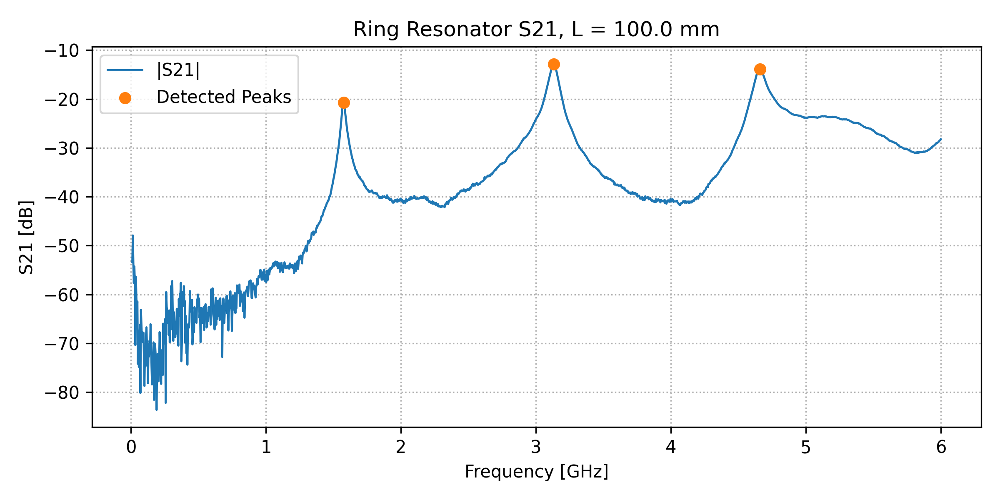

# Substrate Permittivity Extraction Using Ring Resonator


This repository provides a Python-based tool and design assets for extracting the substrate dielectric constant (ε<sub>r</sub>) from S-parameter measurements of a microstrip ring resonator.

---

## 📺 Project Origin

This project was inspired by:
- [YouTube: "PCB Dielectric Constant Extraction with a Ring Resonator" by Gusberti Analog](https://www.youtube.com/watch?v=-Or-rcEIc7o&t=1090s)
- [Article: "Effective Dielectric Characterization for PCB Materials" by Gusberti Analog](https://gusbertianalog.com/effective-dielectric-characterization-for-pcb-materials/)

---

📡 **Purpose**: Characterize PCB materials (e.g., FR4, Rogers) using VNA measurements and resonator geometry.

---


## ▶️ How to Use

### 1. Install Dependencies

```bash
pip install -r requirements.txt
```

### 2. Configure and Run the Script

Edit the parameters in the `substrate_permittivity_extraction.py` file under the CONFIG section:

```python
S2P_FILE       = "example/ring.s2p"
RING_LENGTH_MM = 100.0
SUBSTRATE_H_MM = 1.5
TRACE_W_MM     = 3
```

Run the script:

```bash
python substrate_permittivity_extraction.py
```


### 3. Output

- Table of resonance modes and extracted permittivities
- Optional CSV file with numerical results
- Plots (auto-saved to `figures/`):

<p align="center">
  <br>
  <b>Figure:</b> S21 magnitude with detected resonance peaks
</p>

<p align="center">
  <br>
  <b>Figure:</b> Extracted effective and substrate permittivity vs frequency
</p>

---

## 📘 Citation

If you use this repository or script in your academic work, please consider citing the included paper or referencing this repository.

---

## 📎 License

This project is released under the MIT License.
